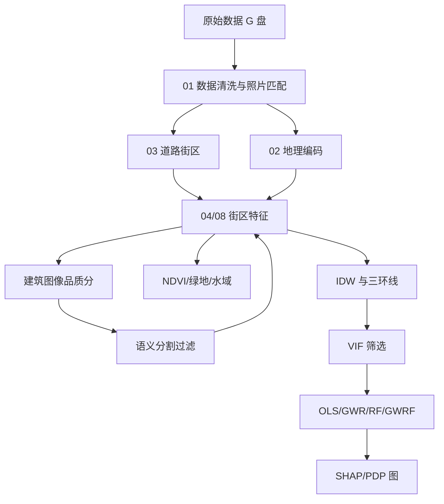

# 项目文件地图

## 流程总览

## 文件分组

| 前缀/目录 | 作用 |
|---|---|
| `scripts/00-02` | 数据准备：盘点、清洗、地理编码 |
| `scripts/03-04` | ArcGIS 街区、IDW、分区统计 |
| `scripts/05-10` | 图像品质分 |
| `scripts/11-21` | 栅格、环线、特征、VIF、模型 |
| `scripts/22-39` | 图表、多年份、动态 POI、三镇模型、GWR/GWRF |
| `src/wuhan_pilot` | 核心函数 |
| `data/raw` | 原始数据登记 |
| `data/processed` | 中间和最终特征表 |
| `images` | 图像评分和分割结果 |
| `reports` | 指标和图 |
| `docs` | 研究协议、数据字典、决策日志、文件地图 |
